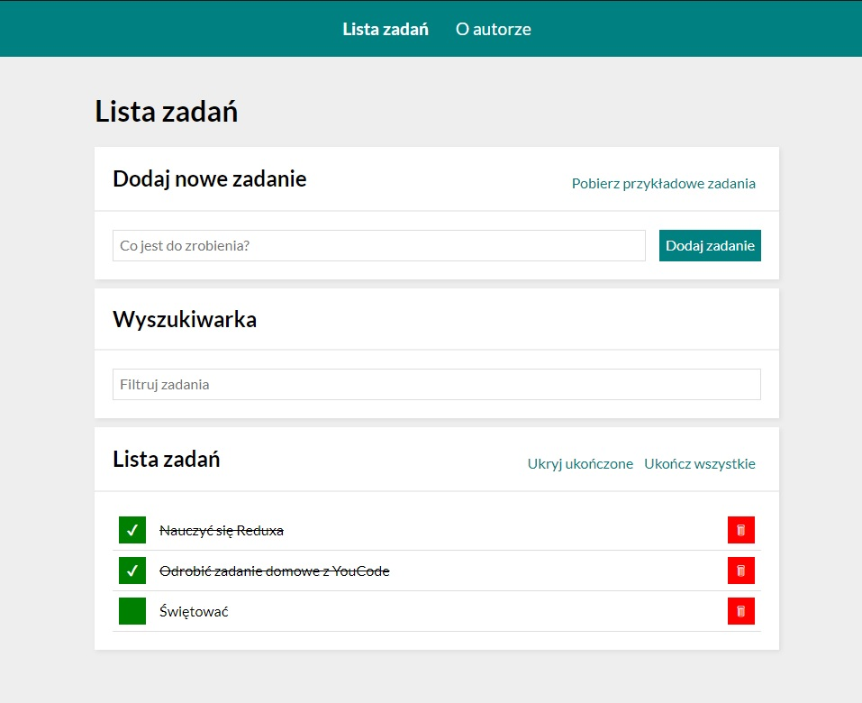

# Do zrobienia

  

> This project is a simple to-do list made with Javascript.

  

> Live demo [_here_](https://dickjaeger.github.io/to-do-list-react/).

  

## Table of Contents

  

* [General Info](#general-information)

  

* [Technologies Used](#technologies-used)

  

* [Features](#features)

  

* [Screenshots](#screenshots)

  

* [Project Status](#project-status)

* [Available scripts](#available-scripts)

* [Acknowledgements](#acknowledgements)

  

* [Contact](#contact)

  

## General Information

  

- The project was created as part of the YouCode programming course.

  

- It helps to organize your own time and doesn't let you forget about things to do.

  

- The purpose of creating this project was to improve my programming skills.

  

## Technologies Used

  
- React 18

- Javascript ES6

- HTML 5

- CSS

- BEM convention

  

## Features

  

- Adding/removing your tasks

- Marking ready tasks

- Hiding ready tasks 

- Setting all tasks ready with one button

  

## Screenshots

  

  

## Project Status

  

Project is: **complete**.

## Available Scripts

In the project directory, you can run:

### `npm start`

Runs the app in the development mode.\
Open [http://localhost:3000](http://localhost:3000) to view it in your browser.

The page will reload when you make changes.\
You may also see any lint errors in the console.

### `npm run build`

Builds the app for production to the `build` folder.\
It correctly bundles React in production mode and optimizes the build for the best performance.

The build is minified and the filenames include the hashes.\
Your app is ready to be deployed!

See the section about [deployment](https://facebook.github.io/create-react-app/docs/deployment) for more information.

### `npm run deploy`

Runs `npm run build` script automatically, then deploys app using gh-pages.

### `npm run eject`

**Note: this is a one-way operation. Once you `eject`, you can't go back!**

If you aren't satisfied with the build tool and configuration choices, you can `eject` at any time. This command will remove the single build dependency from your project.

Instead, it will copy all the configuration files and the transitive dependencies (webpack, Babel, ESLint, etc) right into your project so you have full control over them. All of the commands except `eject` will still work, but they will point to the copied scripts so you can tweak them. At this point you're on your own.

You don't have to ever use `eject`. The curated feature set is suitable for small and middle deployments, and you shouldn't feel obligated to use this feature. However we understand that this tool wouldn't be useful if you couldn't customize it when you are ready for it.

  

## Acknowledgements

  

- This project was based on [YouCode](https://youcode.pl/).

  

- Many thanks to **Krzysiek Dąbrowski** :)

  

## Contact

  

- Created by [Wojciech Leksza](https://github.com/dickjaeger) - feel free to contact me!